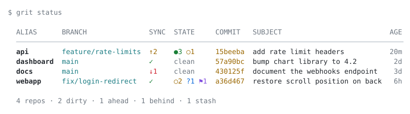

<p align="left">
  <picture>
    <!-- Absolute URLs so the images resolve where a relative path cannot:
         crates.io, and anywhere else the README is rendered outside the
         repository. The cost is that they 404 until the assets are pushed.
         .
         prefers-color-scheme follows the reader's desktop, not their editor
         theme, so a dark editor on a light desktop shows the light wordmark
         on a dark page. That is the media query working; no markup can see an
         editor's own theme.
         .
         No blank line anywhere in this comment: an HTML block ends at one,
         which leaves the `<!--` unterminated and swallows the entire rest of
         the README. GitHub renders 119 bytes and stops. -->
    <source media="(prefers-color-scheme: dark)" srcset="https://raw.githubusercontent.com/eganbruno/grit/main/assets/grit-logo-5a-dark.png">
    <source media="(prefers-color-scheme: light)" srcset="https://raw.githubusercontent.com/eganbruno/grit/main/assets/grit-logo-5a.png">
    
  </picture>
</p>

--- 
[](https://github.com/eganbruno/grit/actions/workflows/ci.yml)

Work across many git and [dolt](https://github.com/dolthub/dolt) repositories from anywhere.

[**Install**](#install) ·
[**Quick start**](#quick-start) ·
[**Commands**](#commands)

Git only works on the directory you are in. That is completely fine until
you have a few repositories: a service and the library it shares, a frontend
and the API behind it, half a dozen side projects, the fork you keep meaning to
rebase, and then the dance between repos every time you need to make changes
across projects.

`grit` lets you manage your repos from wherever you happen to be. Give each one
a short name (and a tag, if it belongs with others) and you can check the
status of all of them in one table, make changes in any one of them, or the
same change across a whole group.

<p align="left">
  <picture>
    <source media="(prefers-color-scheme: dark)" srcset="https://raw.githubusercontent.com/eganbruno/grit/main/assets/status-dark.svg">
    <source media="(prefers-color-scheme: light)" srcset="https://raw.githubusercontent.com/eganbruno/grit/main/assets/status-light.svg">
    
  </picture>
</p>

That is one command, run from anywhere. At a glance: `api` has two unpushed
commits plus three staged and one modified file, `docs` has an upstream commit
waiting, `webapp` has uncommitted work, an untracked file and a stash, and
`dashboard` is clean and up to date.

## Install

Homebrew, on macOS or Linux:

```bash
brew install eganbruno/tap/grit
```

Or a prebuilt binary, no Rust needed:

```bash
curl --proto '=https' --tlsv1.2 -LsSf https://github.com/eganbruno/grit/releases/latest/download/grit-installer.sh | sh
```

From source, if you have a Rust toolchain:

```bash
cargo install --git https://github.com/eganbruno/grit --locked
```

`--locked` builds against the committed `Cargo.lock`. Without it Cargo resolves
dependencies afresh, so a bad upstream release can break your install when a
lockfile build would have been fine.

Prebuilt binaries are published for macOS and Linux on both Apple Silicon/ARM
and Intel/x86.

## Quick start

Register the repos you work across. Any directory inside a repo works — grit
stores the root — and `--tag` puts repos into groups.

```bash
grit -r api       ~/code/api       --tag release,backend
grit -r dashboard ~/code/dashboard --tag release,frontend
grit -r docs      ~/code/docs      --tag release
grit -r webapp    ~/code/webapp    --tag frontend
```

`grit show` lists what you have registered:

```
$ grit show
  ALIAS      KIND  TAGS               PATH
  ────────────────────────────────────────────────────
  api        git   backend, release   ~/code/api
  dashboard  git   frontend, release  ~/code/dashboard
  docs       git   release            ~/code/docs
  webapp     git   frontend           ~/code/webapp

  4 repos · tags: backend, frontend, release · ~/.config/grit/config.toml
```

Then, also from anywhere:

```bash
grit status                     # dashboard across every repo
grit status --tag release       # just the release group
grit status api docs            # just these two

grit docs commit -am "changelog"  # run git in the docs repo
grit api log --oneline -n 10      # any git command, flags and all
grit @release fetch               # run it in every repo tagged `release`
```

Type `grit` on its own and the table appears under your cursor without you
running anything — see
[the dashboard before you ask for it](#the-dashboard-before-you-ask-for-it).

## Commands

| Command | What it does |
| --- | --- |
| `grit -r <alias> [path]` | Register a repo. `path` defaults to `.`. Long forms: `grit register`, `grit add`. |
| `grit rm <alias>...` | Forget an alias. The repository itself is untouched. Long form: `grit remove`. |
| `grit show` | Every registered repo: alias, kind, tags, path. |
| `grit status [alias...]` | Branch, sync state and working-tree state for each repo. |
| `grit detail <alias>` | One repo in depth: changed paths, recent commits, branches, stashes. |
| `grit <alias> <args...>` | Run the repo's own VCS there, with those arguments. |
| `grit @<tag> <args...>` | Run it in every repo carrying that tag. |
| `grit shell enable [shell]` | Add the integration to your shell's startup file. |
| `grit shell disable [shell]` | Take exactly that block back out. |
| `grit shell init <shell>` | Print the integration. `zsh`, `bash` or `fish`. |

`show` and `status` both take `--tag <TAG>` and `--json`; `status` also takes a
list of aliases and `--cached`. `register` takes `--tag` and `--force`, and
`shell enable`/`disable` take `--file`. `--color <auto|always|never>` is
global; `-k` belongs to the fan-out and goes before the target, as in
`grit -k @release fetch`.

`grit help` and `grit help <command>` work as well as `--help` does, and
`grit version` as well as `--version`.

Every command carries its own worked examples, so the exhaustive reference
ships with the binary instead of drifting from it here:

```bash
grit --help                 # the map, and every environment variable
grit status --help          # each flag, and how to read the table
grit register --help        # paths, tags, moving an alias somewhere new
grit detail --help          # what each section shows, and its JSON
grit show --help            # reading the JSON from a script
grit shell enable --help    # which file, and the block it writes
grit help shell enable      # the same thing, spelled the other way
```

### One repo, in depth

`grit status` gives every repo a row. `grit detail <alias>` gives one repo a
card: the same header, then a section each for the changed paths, the last few
commits, the branches and the stash stack. Sections with nothing in them are
left out rather than headed and empty.

```
$ grit detail api
  api  ~/code/api
  git · release

  feature/rate-limits  →  origin/feature/rate-limits  ↑2  ●2 ○1 ?1

  CHANGES
  M   src/limits.rs
   M  src/lib.rs
  A   src/headers.rs
   ?  notes.md

  COMMITS
  15beeba  add rate limit headers                   20m
  8c31f0d  pull the window size out of the config    2h

  BRANCHES
  *  feature/rate-limits  origin/feature/rate-limits  ↑2  add rate limit headers  20m
     main                 origin/main                 ✓   bump chart library      2d

  4 changes · 2 branches
```

The two columns on the left of `CHANGES` are the staged side and the unstaged
side, in git's letters: `M` modified, `A` added, `D` deleted, `R` renamed,
`?` untracked, `U` conflicted. A file staged and then edited again shows `MM`.

In `BRANCHES`, a blank sync column means nothing was compared — the branch has
no upstream, or it has one that has since been deleted. That is deliberately
not `✓`, which claims the two are level.

Unlike the dashboard this takes a fresh reading every time — it is one repo,
asked for by name, and the cache exists for the case that is neither.

### Reading the dashboard

| Column | Meaning |
| --- | --- |
| `SYNC` | `✓` in sync · `↑n` ahead · `↓n` behind · `·` no upstream |
| `STATE` | `●n` staged · `○n` unstaged · `?n` untracked · `!n` conflicts · `⚑n` stashes |

An in-progress merge, rebase, cherry-pick, revert or bisect is named in `STATE`.
A registered path that has been deleted shows up as `missing` rather than
breaking the rest of the dashboard.

### Passthrough

`grit <alias> <args...>` runs git with its stdio inherited, so it behaves
exactly as it would if you had `cd`'d there first — your pager pages, colour
stays on, `$EDITOR` opens for a commit message — and git's exit code becomes
grit's exit code.

The child runs *in the repo root*, so relative paths in arguments resolve
against the repo, not against your current directory.

A group fan-out runs sequentially and stops at the first repo that fails. Pass
`-k` before the target to keep going:

```bash
grit -k @release fetch
```

Each repo is introduced by a `── alias ──` divider and closed by a one-line
receipt:

```console
$ grit @ingress add .
── efdb ────────────────────────────────────────────────────────────────
  ✓ ok

── pipeline ────────────────────────────────────────────────────────────
  ✓ ok

── sources ─────────────────────────────────────────────────────────────
  ✓ ok

  3 repos · all ok
```

The receipt is there because the divider is printed *before* the command runs,
so it promises output that `add`, `checkout` or an up-to-date `fetch` never
produce — and grit cannot print it only in that case, because it cannot tell.
Stdio is inherited, and reading the child's output to find out would cost you
the pager and the colour that make the passthrough worth having. So it is
printed always: one redundant line closing a chatty repo, and the whole answer
for a silent one.

## Configuration

`~/.config/grit/config.toml`, or wherever `$GRIT_CONFIG` points. It is plain
TOML and meant to be edited by hand or checked into your dotfiles:

```toml
version = 1

[repos.api]
path = "/home/you/code/api"
kind = "git"
tags = ["backend", "release"]
added_at = "2026-08-03T11:49:22Z"
```

`$XDG_CONFIG_HOME` moves that default, and grit deliberately uses the
XDG location on macOS too — `~/Library/Application Support` is right for a GUI
app, but a CLI's config belongs where you can dotfile-manage it.

Colour follows [`NO_COLOR`](https://no-color.org) and switches off when stdout
is not a terminal. `--color always|never|auto` overrides both. When stdout is
not a terminal there is no width to measure, so `$COLUMNS` is used if set.

The last dashboard is cached under `~/.cache/grit/status.json` — or wherever
`$GRIT_CACHE` points, or `$XDG_CACHE_HOME` moves it to. Deleting it costs one `grit status`. It is refused rather
than trusted whenever the registry has changed since it was written, so a repo
you have just removed can never appear in a preview.

## The dashboard before you ask for it

Type `grit` and the table appears under your cursor. Keep typing and it
goes away.

```
$ grit
  ALIAS      BRANCH               SYNC  STATE     COMMIT   SUBJECT                          AGE
  ─────────────────────────────────────────────────────────────────────────────────────────────
  api        feature/rate-limits  ↑2    ●3 ○1     15beeba  add rate limit headers           20m
  dashboard  main                 ✓     clean     57a90bc  bump chart library to 4.2         2d

  2 repos · 1 dirty · 1 ahead · 4s ago
```

Checking is the thing you skip when it costs a command of its own, which is how
you end up committing on the wrong branch. This costs a pause. Turn it on with:

```bash
grit shell enable
```

That adds a marked block to your shell's startup file and tells you which file
it touched; `grit shell disable` takes exactly that block back out. It edits a
startup file when you ask it to and at no other time — installing grit changes
nothing on its own. `grit shell enable zsh` if `$SHELL` is not the shell you
mean, and `--file` to write somewhere else.

If you would rather add the line yourself, that is all the block contains:

```bash
eval "$(grit shell init zsh)"
```

#### Browsing them: `^G^G`

`^G^G` opens a picker over every registered repo, with `grit detail` rendered
beside it as you move:

```
> api                                                 api  ~/code/api
  api     feature/rate-limits  ↑2  ●3 ○1              git · release
  docs    main                 ✓   clean
  webapp  main                 ·   ○2 ?1 ⚑1           feature/rate-limits → origin/…  ↑2
  4/4                                                 CHANGES
  enter: run git here · ctrl-d: cd · ctrl-r: refresh   M   src/limits.rs
                                                       ?  notes.md
```

`enter` puts `grit <alias> ` on the command line for you to finish — which
command you wanted is the part grit cannot guess. `ctrl-d` cds there instead,
and `ctrl-r` takes a fresh reading.

This one needs [fzf](https://github.com/junegunn/fzf) on your `PATH`; without
it the key says so and does nothing else. grit supplies the two halves — the
rows, and the pane — and fzf does the navigating.

**`^G` is a prefix now, so the inline table above is on `^G^P`.** Nothing is
bound to `^G` alone: a line editor waits for the second key before it will
admit none is coming — 404ms in zsh, 504ms in readline — and charges that to
the shorter binding, every press. The letters also keep clear of
[fzf-git.sh](https://github.com/junegunn/fzf-git.sh)'s
`^G^{f,b,t,r,h,s,l,e,w}`, since that tool is common and claims `^G` as well.

`GRIT_PREVIEW_KEY='^G'` before the eval gets the old single key back if you
want it; it will just pause. grit binds what you ask for and does not
rearrange it.

It is the same table `grit status` prints, drawn from a cache so it costs
nothing to show, with a note in the footer saying how old the reading is. A
refresh runs behind it, and a reading old enough to mislead is not shown at all
— you get the fresh one a moment later instead.

Nothing runs unless the buffer is a trigger: the timer is armed when the buffer
becomes `grit` and torn down the moment it stops being, so an ordinary line
costs nothing at all. `TMOUT` and `TRAPALRM` are left alone, so an auto-logout
you have configured keeps working.

Set these *before* the `eval`, since the key is bound as the script is sourced:

| Setting | What it does |
| --- | --- |
| `GRIT_PREVIEW_TRIGGERS` | array of buffers that summon it. Default `(grit)`. |
| `GRIT_PREVIEW_DELAY` | seconds of stillness first; fractions allowed. Default `0.5`. |
| `GRIT_PREVIEW_KEY` | key that draws it on demand. Default `^G` in zsh, `\C-g` in bash, `\cg` in fish. Setting it empty binds nothing in zsh; bash and fish fall back to the default. |
| `GRIT_PREVIEW_IDLE` | `0` for the key only, no timer. |

**bash and fish** get `Ctrl-G` instead of the pause, because neither runs a hook
while you sit at the prompt. `grit shell enable` handles them too, writing the
right line for the shell into the right file:

```bash
grit shell enable bash            # ~/.bashrc
grit shell enable fish            # ~/.config/fish/config.fish
```

The cached dashboard is a command in its own right, and cheap enough for a
prompt or a tmux status line:

```bash
grit status --cached              # the last reading, in milliseconds
```

It exits non-zero and prints nothing when there is no reading to show, so a
script can tell that apart from an empty registry.

## How it works

grit shells out to the real `git` and `dolt` binaries rather than linking a
library. That keeps the dependency tree pure Rust, guarantees your own config is
honoured, and means the dashboard and the passthrough use one mechanism instead
of two.

Everything grit does to a repository goes through one trait, `vcs::Vcs`, so both
backends land in the same dashboard and `grit <alias> <args>` passes through to
whichever binary owns that repo. Registration works out which that is by looking
at the path, so you never have to say.

The two are read very differently underneath. Git has a machine-readable
porcelain format; dolt does not, but it is a database, so its readings come from
the `dolt_*` system tables over `dolt sql`. Where dolt has no equivalent for
something the dashboard shows, the column is simply quiet — dolt has no detached
HEAD, and no rebase or bisect state to report.

Supporting another git-like system is one new implementation of four methods; no
command, renderer or registry code changes.

## Contributing

See [CONTRIBUTING.md](CONTRIBUTING.md) for the layout, the recipe for adding a
command, and how to run the tests.

## License

MIT or Apache-2.0, at your option.
